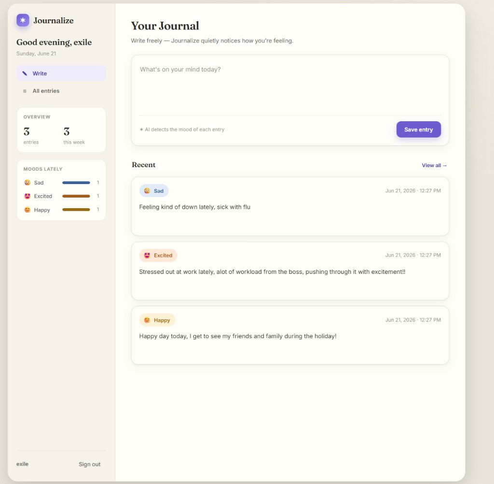
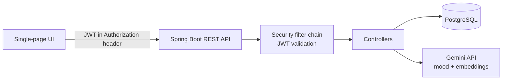

# ✶ Journalize

A private journaling web app with **AI-powered mood detection** and **semantic (meaning-based) search**. Write freely, and let the app quietly surface how you've been feeling and help you rediscover past entries by meaning — not just keywords.

<p>
  
  
  
  
  
</p>

> **Live demo:** **[journalize.onrender.com](https://journalize.onrender.com/)**
> First load may take ~30–50s if the free instance is asleep.



---

## ✨ Features

- **Secure accounts** — registration & login with BCrypt-hashed passwords and stateless **JWT** authentication.
- **Per-user journaling** — full CRUD on entries, with strict ownership checks (you can only ever see or touch your own entries).
- **AI mood detection** — every entry is analyzed by Google **Gemini** and tagged with a mood, surfaced as color-coded badges.
- **Semantic search** — find entries by *meaning* using **vector embeddings + cosine similarity** (e.g. searching “overwhelmed at work” finds an entry that said “drowning in deadlines”).
- **Mood insights** — a sidebar dashboard aggregates your moods over time so you can see patterns you'd otherwise miss.
- **Polished UI** — a responsive single-page app (Write / All entries views, sort, mood filter, inline edit) served directly by the backend.
- **Fail-soft AI** — if the AI API is unavailable, journaling still works; AI features degrade gracefully instead of breaking.

---

## 🛠 Tech Stack

| Layer | Technology |
|---|---|
| Language | Java 21 |
| Framework | Spring Boot 4 (Web MVC, Data JPA, Security, Validation) |
| Auth | Spring Security + JWT (jjwt) + BCrypt |
| Database | PostgreSQL (Docker locally, Neon in production) |
| AI | Google Gemini — `gemini-2.5-flash` (mood) & `text-embedding-004` (embeddings) |
| Frontend | Vanilla HTML/CSS/JS single-page app |
| Testing | JUnit 5, MockMvc, Mockito, **Testcontainers** (real PostgreSQL) |
| Build & Deploy | Maven, Docker (multi-stage) |

---

## 🏗 Architecture



- A custom **`JwtAuthFilter`** validates the bearer token on each request and sets the authenticated user.
- On entry creation, the app calls Gemini twice — once for the **mood**, once for the **embedding vector** (stored for search).
- Search embeds the query and ranks entries by **cosine similarity** in the service layer.

---

## 🚀 Getting Started (local)

### Prerequisites
- Java 21
- Docker (for the local PostgreSQL)
- A free [Google AI Studio](https://aistudio.google.com/apikey) API key (for AI features)

### Setup

```bash
# 1. Clone
git clone https://github.com/kenzofnu/journalize.git
cd journalize

# 2. Create your local config from the template
cp src/main/resources/application.properties.example src/main/resources/application.properties
# then edit it: set jwt.secret and gemini.api.key

# 3. Start PostgreSQL
docker compose up -d

# 4. Run the app
./mvnw spring-boot:run        # use mvnw.cmd on Windows
```

Open **http://localhost:8200**, create an account, and start journaling.

---

## ⚙️ Configuration

All configuration lives in `application.properties` (gitignored). See `application.properties.example` for the full list. Key values:

| Property | Description |
|---|---|
| `spring.datasource.*` | PostgreSQL connection |
| `jwt.secret` | Secret used to sign JWTs (32+ chars) |
| `jwt.expiration-ms` | Token lifetime (default 1 hour) |
| `gemini.api.key` | Google Gemini API key |
| `gemini.model` | Chat model for mood detection |
| `gemini.embedding-model` | Embedding model for search |

In production these are supplied via environment variables (see Deployment).

---

## 📡 API

| Method | Endpoint | Description | Auth |
|---|---|---|---|
| `POST` | `/api/auth/register` | Create an account | Public |
| `POST` | `/api/auth/login` | Log in, returns a JWT | Public |
| `POST` | `/api/entries` | Create an entry (mood + embedding generated) | Required |
| `GET` | `/api/entries` | List your entries | Required |
| `GET` | `/api/entries/{id}` | Get one entry | Required |
| `PUT` | `/api/entries/{id}` | Update an entry | Required |
| `DELETE` | `/api/entries/{id}` | Delete an entry | Required |
| `GET` | `/api/entries/search?q=` | Semantic search your entries | Required |

---

## 🧪 Testing

```bash
./mvnw test
```

- **Unit tests** for JWT logic (token round-trip, tampering, expiry).
- **Integration tests** with **Testcontainers** — spin up a real PostgreSQL container and drive the full HTTP stack with `MockMvc`, covering registration, login, validation, and per-user authorization (including cross-user access returning 403). External AI calls are mocked so tests run offline and fast.

---

## ☁️ Deployment

Deployed as a Docker container with a managed PostgreSQL database.

- **App:** any container host (e.g. Render) builds from the included `Dockerfile`.
- **Database:** a managed PostgreSQL (e.g. Neon).
- Activate the production profile with `SPRING_PROFILES_ACTIVE=prod` and supply secrets via env vars:
  `SPRING_DATASOURCE_URL`, `SPRING_DATASOURCE_USERNAME`, `SPRING_DATASOURCE_PASSWORD`, `JWT_SECRET`, `GEMINI_API_KEY`.

---

## 🗺 Roadmap

- Weekly AI reflection (patterns across the week)
- Theme tagging & filtering
- Mood-over-time charts
- `pgvector` for database-side similarity search at scale

---

## 📄 License

MIT — feel free to learn from or build on this.
